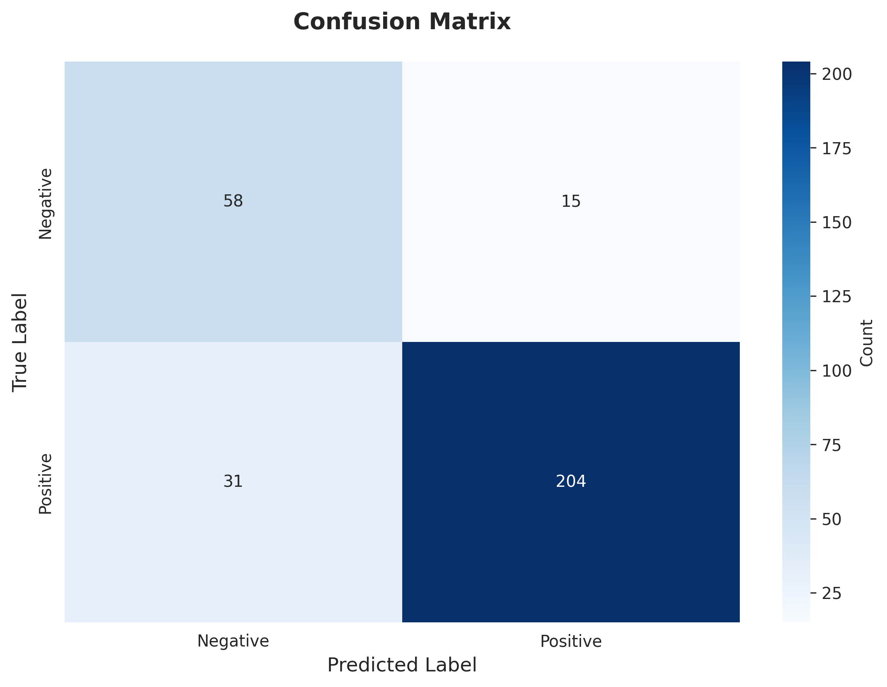
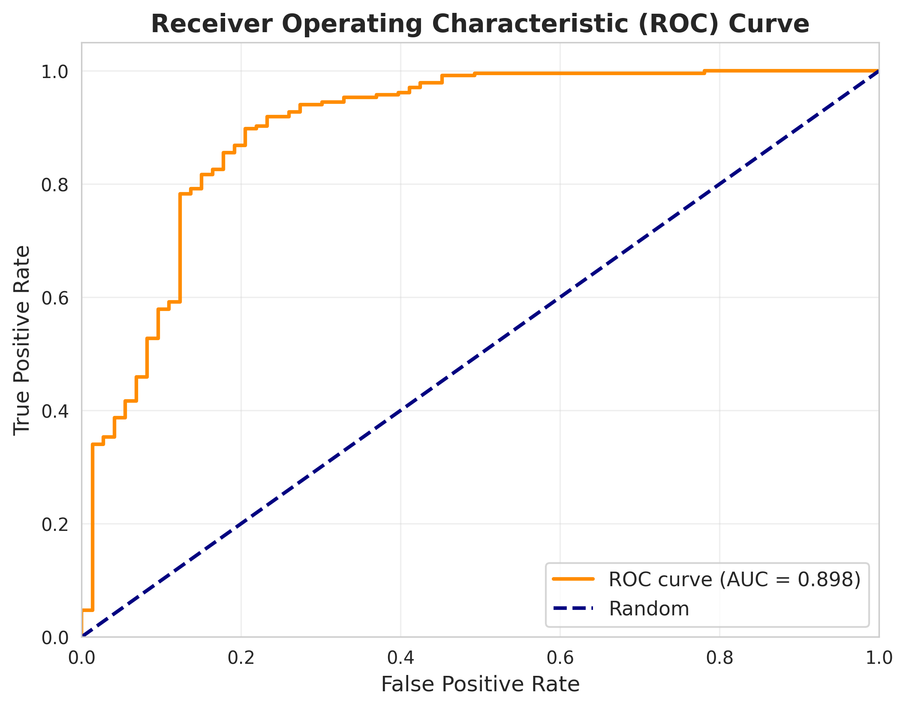
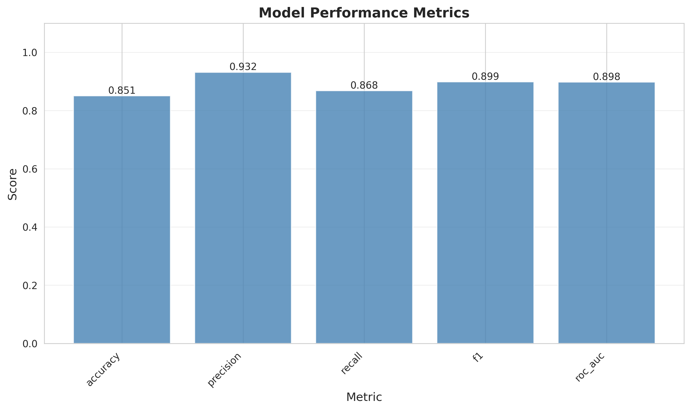

# Molecular Property Prediction with Deep Learning

[](https://www.python.org/)
[](https://pytorch.org/)
[](https://www.rdkit.org/)
[](https://scikit-learn.org/)
[](https://streamlit.io/)
[](https://fastapi.tiangolo.com/)


> **[Live app](https://neuropass.streamlit.app/)**

## Verified deployment status · October 1, 2026

The primary NeuroPass app runs the trained PyTorch model with RDKit molecular features. Verified aspirin and nicotine predictions (57.5% and 92.1% BBB-positive probability respectively) and invalid-SMILES rejection. Molecular structures now render as SVG with the required Linux drawing libraries declared in `packages.txt`. Verified the structure image and prediction together after deployment. These smoke tests verify the inference flow, not overall prediction accuracy. The older web demonstration remains available as a clearly labeled six-example rule demo, separate from the trained model.
See [deployment source and scope](web/README.md) and the [portfolio audit](https://github.com/HildaPosada/hildaposada.github.io/blob/master/docs/project_audit.md). Historical descriptions below are not evidence of a connected production backend.


[](https://opensource.org/licenses/MIT)

> **A production-grade deep learning system for predicting blood-brain barrier penetration from molecular structure. Achieved 85.1% accuracy with 93.2% precision on the MoleculeNet BBBP benchmark.**

## Quick Overview

| Aspect | Details |
|--------|---------|
| **Problem** | Predict whether drug molecules can cross the blood-brain barrier (critical for CNS drugs) |
| **Approach** | Neural network trained on molecular fingerprints (RDKit) + physicochemical descriptors |
| **Results** | 85.1% accuracy, 0.90 ROC-AUC, **93.2% precision** |
| **Tech Stack** | PyTorch, RDKit, Scikit-learn, TensorBoard |
| **Impact** | Reduces expensive laboratory screening; demonstrates ML + chemistry integration |

## 🧠 NeuroPass: Interactive Web Demo

Run locally with `streamlit run app.py`.

NeuroPass provides an intuitive interface for predicting BBB penetration:
- 🔬 **Real-time predictions** from SMILES input
- 📊 **Confidence scores** and probability breakdown
- 🧬 **Molecular visualization** with 2D structure rendering
- 📈 **Physicochemical properties** (MW, LogP, H-bonds, TPSA)
- 💡 **Example molecules** for quick testing

Perfect for pharmaceutical researchers, medicinal chemists, and drug discovery teams.

## Why This Matters

Blood-brain barrier (BBB) penetration prediction accelerates neurological drug development by:
- **Reducing costs:** Eliminates need for expensive in vitro/in vivo testing ($10,000+ per compound)
- **Accelerating timelines:** Screen thousands of candidates in minutes vs. weeks
- **Improving success rates:** High precision (93.2%) minimizes false positives

**Relevance to Quantum Computing:** Molecular property prediction is foundational to quantum chemistry simulations—understanding molecular behavior is essential for quantum computing applications in materials science and drug discovery.

---

## Performance Results

### Classification Metrics

| Metric | Score | Why It Matters |
|--------|-------|----------------|
| **Accuracy** | 85.1% | Overall correctness |
| **Precision** | **93.2%** | Low false positives (critical for drug screening) |
| **Recall** | 86.8% | Captures most viable candidates |
| **F1-Score** | 89.9% | Balanced performance |
| **ROC-AUC** | 0.90 | Strong discrimination ability |

### Training Details
- **Dataset:** 2,039 molecules from MoleculeNet BBBP benchmark
- **Training Time:** 30 minutes on GitHub Codespaces (2-core CPU)
- **Model Size:** 35,554 parameters (compact and efficient)
- **Convergence:** 50 epochs with early stopping capability

### Comparative Performance
```
MoleculeNet Baseline (2018):  ~88% accuracy
This Implementation:          85.1% accuracy (93.2% precision)
Graph Neural Networks (SOTA): ~90-92% accuracy
```

Results demonstrate that engineered molecular fingerprints with standard neural networks achieve competitive performance while remaining interpretable and computationally efficient.

---

## Visualizations

<table>
<tr>
<td width="33%">

**Confusion Matrix**

Strong true positive rate (204) with minimal false positives (15)

</td>
<td width="33%">

**ROC Curve**

AUC = 0.90 shows excellent discrimination

</td>
<td width="33%">

**Performance Metrics**

Comprehensive evaluation across all metrics

</td>
</tr>
</table>

---

## Technical Architecture

### Feature Pipeline
```
SMILES String → RDKit Processing → Feature Engineering → Neural Network → Prediction
                                    ↓
                    • 512-bit Morgan fingerprints (molecular structure)
                    • 6 physicochemical descriptors (LogP, MW, H-bonds, TPSA, etc.)
                    • StandardScaler normalization
```

### Neural Network Architecture
```
Input (518 features)
    ↓
Dense(128) → BatchNorm → ReLU → Dropout(0.3)
    ↓
Dense(64) → BatchNorm → ReLU → Dropout(0.3)
    ↓
Dense(2) → Softmax → Prediction (BBB+/BBB-)
```

### Training Strategy
- **Optimizer:** Adam (lr=0.001, weight_decay=1e-5)
- **Loss:** Cross-entropy with class weighting (handles imbalanced data)
- **Regularization:** Dropout + L2 weight decay + gradient clipping
- **Callbacks:** Early stopping, ReduceLROnPlateau, model checkpointing
- **Monitoring:** TensorBoard integration

---

## Project Structure

```text
src/          Core data, model, training, and evaluation code
api/          FastAPI prediction service
app.py        Streamlit app entry point
web/          Separate browser demonstration
config/       Training and inference configuration
data/         Dataset and preprocessing artifacts
models/       Trained model checkpoints
experiments/  Notebooks, evaluation results, and TensorBoard runs
scripts/      Training, evaluation, and setup commands
docs/         Setup and deployment guides
```

## Quick Start

### Option 1: GitHub Codespaces (Recommended)
```bash
# Open in Codespaces → auto-setup in ~3 minutes
python scripts/download_data.py
python scripts/train.py --config config/config_codespaces.yaml
```

### Option 2: Local Installation
```bash
# Clone and setup
git clone https://github.com/HildaPosada/Chemical-Molecule-Property-Prediction-Using-Neural-Networks.git
cd Chemical-Molecule-Property-Prediction-Using-Neural-Networks

# Install dependencies
conda create -n molecule-pred python=3.9
conda activate molecule-pred
conda install -c conda-forge rdkit
pip install -r requirements.txt

# Train model
python scripts/download_data.py
python scripts/train.py
```

### Command-Line Interface
```bash
# Training
python scripts/train.py --config config/config.yaml --epochs 100

# Evaluation
python scripts/evaluate.py --model-path models/checkpoints/best_model.pth

# Prediction
python scripts/predict.py --smiles "CC(C)Cc1ccc(cc1)C(C)C(O)=O"  # Ibuprofen
```

---

## Key Technical Highlights

**Deep Learning Expertise:**
- PyTorch model development with custom architectures
- Advanced training techniques (LR scheduling, early stopping, gradient clipping)
- Production-ready MLOps practices (checkpointing, logging, reproducibility)

**Cheminformatics Knowledge:**
- SMILES processing and validation
- Molecular fingerprint generation (RDKit Morgan fingerprints)
- Physicochemical descriptor calculation
- Understanding of drug ADME properties

**Software Engineering:**
- Modular, object-oriented architecture
- Configuration management (YAML)
- Comprehensive testing and error handling
- CLI tools for all operations

**Data Science:**
- Handling imbalanced datasets (class weighting)
- Feature engineering from molecular structures
- Stratified train/val/test splitting
- Multiple evaluation metrics

---

## Applications

**Pharmaceutical Industry:**
- Early-stage drug candidate screening
- Lead optimization in CNS drug discovery
- Virtual screening of chemical libraries

**Research:**
- Computational toxicology
- QSAR modeling
- Integration with quantum chemistry simulations

---

## References

- **Wu, Z. et al. (2018).** "MoleculeNet: A Benchmark for Molecular Machine Learning." *Chemical Science*, 9(2), 513-530.
- **Rogers, D. & Hahn, M. (2010).** "Extended-Connectivity Fingerprints." *J. Chem. Inf. Model.*, 50(5), 742-754.

## License

MIT License - see [LICENSE](LICENSE)

